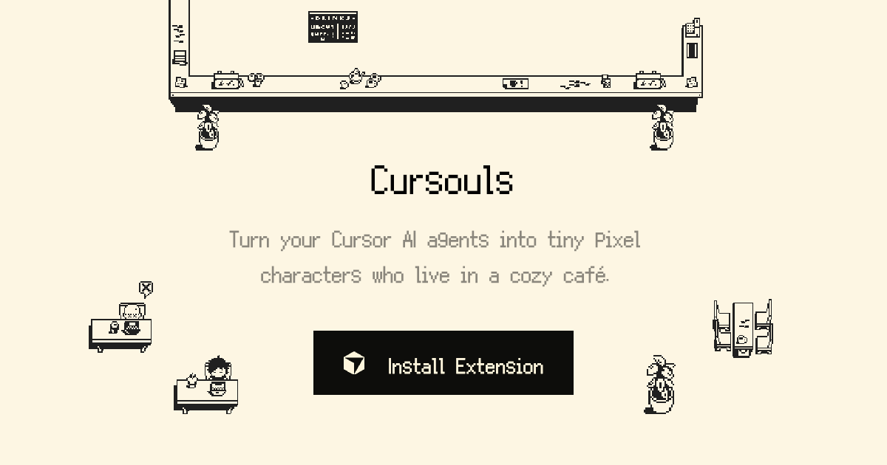

<p align="center">
  <a href="https://cursouls.xyz">
    
  </a>
</p>

<h3 align="center">Cursouls</h3>

<p align="center">
  Turn your Cursor into tiny pixel characters that live in a cozy cafe<br/>with your AI agents, reacting, assisting, and keeping you company while you work.
</p>

<p align="center">
  <a href="https://cursouls.xyz">Website</a> &middot;
  <a href="https://github.com/vtemian/cursouls">Extension</a>
</p>

---

### Development

```bash
npm install
npm run dev
```

### Scripts

| Command                | Description             |
| ---------------------- | ----------------------- |
| `npm run dev`          | Start dev server        |
| `npm run build`        | Static export to `out/` |
| `npm run lint`         | Run ESLint              |
| `npm run format`       | Format with oxfmt       |
| `npm run format:check` | Check formatting        |

### Authors

Created by [Vlad Temian](https://x.com/vtemian) and [Marius Balaj](https://x.com/balajmarius).
